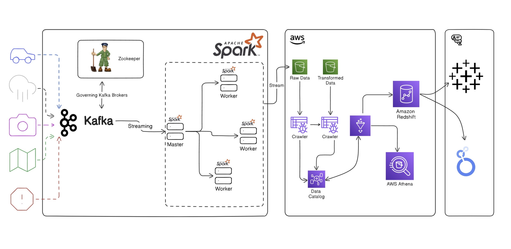

# 🚀 **TransitFlow Realtime Event Stream** (using Kafka & Spark) 🌆

Welcome to the **TransitFlow Realtime Event Stream** project! This innovative solution integrates various data streams from IOT devices, processes them in real-time, and stores the results for analytics. 📊 With a focus on scalability and efficiency, this project leverages AWS services to create a robust data architecture. 👨‍💻

---

## 💡 **Project Overview**

In this project, we’re diving deep into how transit data (vehicles, weather, traffic, etc.) is captured, processed, and stored in real-time! 🌍 Utilizing tools like Kafka and Spark, and powered by AWS Glue, Redshift, and Athena, this pipeline ensures data flows smoothly from ingestion to analysis. 

---

## ⚙️ **Technologies Used**

- **AWS Glue**: ETL operations & data cataloging 📚
- **AWS Crawler**: Automatically discover and catalog data in S3 🗂️
- **AWS Athena**: Query data in S3 using SQL without moving it 🎯
- **AWS Redshift**: Data warehousing & analytics powerhouse 💾
- **Apache Kafka**: Real-time data streaming 🌐
- **Apache Spark**: Large-scale data processing ⚡
- **Docker**: Containerization for local Spark and Kafka setup 🐳

---

## 🏛️ **Architecture Diagram**


*This diagram illustrates the data flow through various components of the TransitFlow.* 🛣️

---

## ✨ **Key Features**

- **Real-Time Data Processing**: Ingest and process streams from vehicles, weather stations, and traffic cameras in real-time! 🚗🌦️📷
- **Scalable Architecture**: Built on AWS services to handle any data load, big or small 🏗️
- **Advanced Data Analytics**: AWS Athena and Redshift power the analytics, making queries and reporting a breeze 🎯📊
- **Automated ETL**: AWS Glue handles the heavy lifting for ETL with minimal manual intervention ⚙️

---

## 📁 **Project Structure**

```bash
/TransitFlow-RT-Event-Stream-using-kafka
│
├── jobs/
│   ├── main.py                # Main simulation script 🚗
│   ├── configurations.py      # AWS credentials config 🔐
│   └── spark-job.py           # Spark streaming application ⚡
│
├── requirements.txt           # Python dependencies 📦
└── docker-compose.yml         # Docker setup for local development 🐳
```

---

## 🚀 **Installation and Setup**

1. **Clone the repository**:  
   ```bash
   git clone https://github.com/Analyst-Ninja/TransitFlow-RT-Event-Stream-using-kafka.git
   cd TransitFlow-RT-Event-Stream-using-kafka
   ```

2. **Create Python Virtual Environment**:  
   ```bash
   python3 -m venv .venv
   ```
3. **Install dependencies**:  
   ```bash
   pip3 install -r requirements.txt
   ```

4. **Configure AWS credentials**:  
   Set up your AWS credentials in `config.py` 🔐.
   ```python
   configurations = {
      "AWS_ACCESS_KEY" : "YOUR_ACCESS_KEY",
      "AWS_SECRET_KEY" : "YOUR_SECRET_KEY",
      "S3_BUCKET_NAME" : "YOUR_S3_BUCKET_NAME",
   }
   ```

---

## ▶️ **Running the Project**

### **Step 1: Spin up Docker containers**
Start the services (Kafka, Spark, etc.) using Docker:  
```bash
docker-compose up -d
```

### **Step 2: Simulate Real-Time Data**
Run the main script to simulate vehicle movements and stream data to Kafka:  
```bash
python3 jobs/main.py
```

### **Step 3: Process and Load Data into S3**
Open a separate terminal and run the Spark streaming job to process the data and load it into S3:  
```bash
docker exec -it transitflow-rt-event-stream-using-kafka-spark-master-1 spark-submit --master spark://spark-master:7077 --packages org.apache.spark:spark-sql-kafka-0-10_2.12:3.5.0,org.apache.hadoop:hadoop-aws:3.3.1,com.amazonaws:aws-java-sdk:1.11.469 jobs/spark-job.py
```

### **Step 4: Catalog Data for Analytics**
After the data is loaded to S3, **AWS Glue Crawlers** will automatically discover and catalog the data in the Glue Data Catalog 🗃️. This enables querying via **AWS Athena** (SQL Query Editor) and data warehousing in **AWS Redshift Serverless** for deeper analytics and dashboards 🎯.

---

## 🔄 **ETL Workflow**

1. **Data Ingestion**: Simulated vehicle data is sent to Kafka topics in real-time 🛰️.
2. **Data Processing**: Apache Spark reads data from Kafka, processes it, and writes the results to AWS S3 📂.
3. **Data Cataloging**: AWS Glue crawlers automatically discover new datasets in S3 and update the Glue Data Catalog 🗃️.
4. **Data Querying & Warehousing**: AWS Athena lets you run SQL queries on processed data directly in S3, and the data is also loaded into **AWS Redshift Serverless** for analytics and dashboarding purposes 📊.

---

## 🛠️ **Troubleshooting**

- Ensure AWS credentials are correctly set in `config.py` 🔐.
- Check Docker logs if you're using Docker for local development 🐳.
- Verify that all required services (Kafka, Spark) are running smoothly 🏃‍♂️.

---

## 🌟 **Upcoming Features**

Stay tuned for exciting updates like:
- **Enhanced Analytics Dashboards**: Advanced visualizations to make insights pop! 📊✨
- **Additional Data Sources**: Expand beyond traffic and weather for a richer experience 🚧.
- **Machine Learning Integration**: Predictive analytics using real-time data 💡🤖.

---

## 🤝 **Contributing**

Contributions are always welcome! 🎉 Fork this repo and submit a pull request with your enhancements or bug fixes. Let's build it together! 🌍

---

## 💬 **Contact**

Have questions or suggestions? Feel free to reach out:  
📧 [r.kumar01@hotmail.com](mailto:r.kumar01@hotmail.com)  
🌐 [LinkedIn](https://www.linkedin.com/in/analyst-ninja/)

---

### Happy Coding & Stay Smart! 💡🌆

---
